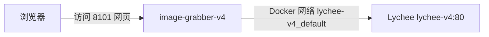

# image-grabber VPS 部署指南（通过 GitHub）

本指南把「网页图片抓取 → Lychee v4」服务部署到 VPS。仓库：https://github.com/dgltsp-cpu/lychee-v4-web-grabber（私有），仅适配 Lychee v4.13.0（Lychee 部署见 https://github.com/dgltsp-cpu/lychee-v4）。

## 0. 架构与前置



前置条件：

1. VPS 已部署 **Lychee v4**（项目目录名必须是 `lychee-v4`，compose 网络名才会是 `lychee-v4_default`）
2. 已创建 Lychee 管理员账号
3. 在 Lychee **设置 → API → 新建令牌**，生成一个 API Token（本服务上传图片用）

## 1. 连接 VPS

```bash
ssh root@137.175.102.212 -p 64898
```

## 2. 配置 Deploy Key（私有仓库只读授权）

GitHub 的 Deploy Key 是**按仓库**生效的，grabber 需要单独一把（不能复用 lychee-deploy 的）：

```bash
ssh-keygen -t ed25519 -f ~/.ssh/grabber_deploy -N "" -C "grabber-deploy"
cat ~/.ssh/grabber_deploy.pub
```

复制输出的整行公钥，打开 https://github.com/dgltsp-cpu/lychee-v4-web-grabber/settings/keys → **Add deploy key**：
- Title：`grabber-vps`
- Key：粘贴公钥
- 不要勾选 *Allow write access* → Add key

验证授权：

```bash
ssh -i ~/.ssh/grabber_deploy -T git@github.com
# 期望输出：Hi dgltsp-cpu! You've successfully authenticated
```

## 3. 克隆代码

```bash
GIT_SSH_COMMAND='ssh -i ~/.ssh/grabber_deploy' \
  git clone git@github.com:dgltsp-cpu/lychee-v4-web-grabber.git
cd lychee-v4-web-grabber
```

## 4. 配置 .env

```bash
cp .env.example .env
nano .env
```

必填项：

```ini
LYCHEE_URL=http://lychee-v4:80   # 与 Lychee v4 同网络(lychee-v4_default)，用容器服务名，不要填公网 IP
LYCHEE_TOKEN=你的Lychee_API_Token    # 第 0 步生成的令牌
UPLOAD_METHOD=multipart              # multipart=本服务下载后上传; import=Lychee 服务端直拉
MAX_IMAGES=200
BLOCK_PRIVATE_NETWORKS=true          # 抓内网站点改为 false
```

## 5. 构建并启动

> 抓图服务默认**从源码构建**（compose 已默认 `build: .`；GHCR 预构建镜像目前仅 arm64，x86 VPS 请用源码构建）。

```bash
docker compose up -d --build
```

- 首次构建要下载 Playwright Chromium（约 3~8 分钟）
- 容器自动加入外部网络 `lychee-v4_default`

验证：

```bash
docker compose ps                              # image-grabber 应为 Up
curl -s http://127.0.0.1:8101 | head           # 返回页面 HTML 即成功
```

## 6. 使用

浏览器打开 `http://VPS_IP:8101`：

1. 粘贴网页/相册 URL → 预览图片列表
2. 勾选图片 → 选择 Lychee 相册 → 转存
3. Token 也可在网页右上角设置里填写（优先于 .env）

## 7.（可选）Nginx 反代 + HTTPS

不建议把 8101 直接暴露公网（工具无多用户鉴权）。推荐先改 compose 端口为仅本机：

```yaml
ports:
  - "127.0.0.1:8101:8000"
```

然后 `docker compose up -d`，Nginx 配置（示例，证书路径按实际）：

```nginx
server {
    listen 80;
    server_name grab.你的域名;
    return 301 https://$host$request_uri;
}

server {
    listen 443 ssl http2;
    server_name grab.你的域名;
    # ssl_certificate     /path/to/fullchain.pem;
    # ssl_certificate_key /path/to/privkey.pem;
    client_max_body_size 600m;      # 允许上传大视频

    location / {
        proxy_pass http://127.0.0.1:8101;
        proxy_set_header Host $host;
        proxy_set_header X-Real-IP $remote_addr;
        proxy_set_header X-Forwarded-For $proxy_add_x_forwarded_for;
        proxy_set_header X-Forwarded-Proto $scheme;
        proxy_read_timeout 600s;
    }
}
```

```bash
sudo ln -s /etc/nginx/sites-available/grabber /etc/nginx/sites-enabled/
sudo nginx -t && sudo systemctl reload nginx
```

## 8. 升级

```bash
GIT_SSH_COMMAND='ssh -i ~/.ssh/grabber_deploy' git pull
docker compose up -d --build
```

## 常见问题

| 现象 | 原因 / 解决 |
|---|---|
| `network lychee-v4_default declared as external, but could not be found` | Lychee v4 未启动，或 Lychee 项目目录名不是 `lychee-v4`。先启动 Lychee 再启动本服务 |
| 抓图页连不上 Lychee | ① `.env` 里 `LYCHEE_URL` 是否还是占位符；② 确认 Lychee 项目目录名是 `lychee-v4`（网络固定 `lychee-v4_default`）；③ Token 是否正确 |
| 上传返回 401 | Token 无效或权限不足，到 Lychee 设置 → API 重新生成 |
| 抓取图片全部加载失败 | 目标站防盗链严格；可手动点图，或换 `UPLOAD_METHOD=import` |
| 抓内网站点 502 | `.env` 设 `BLOCK_PRIVATE_NETWORKS=false` 后重建容器 |
| 视频传不上去 | `MAX_VIDEO_BYTES` 默认 500MB；Nginx 需 `client_max_body_size` 足够大 |
