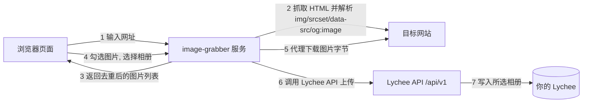

# 网页图片抓取 → Lychee (image-grabber)

> ⚠️ 本目录是 **Lychee v4.13.0 专用版**（API 走 v1，端口 8101）。
> 另有一个面向 v7.7.3 的版本在 `../lychee-web-grabber`（端口 8100）。
> 除原版全部功能外，本版新增 **相册图片管理**（选中相册即显示相册内的图片，
> 可单选/多选删除）与 **清空相册**（一键删除相册内全部照片，相册本身保留），
> 并把界面拆成 **抓取转存 / 相册管理** 两个互不混显的独立界面（整屏左右滑动切换，
> 两个相册下拉框互不干扰，进相册管理界面自动展开图片面板）。
> 相册管理界面还支持 **上传本地图片/视频**（选完直接传）。
> 网址框还带 **📷 扫码**：手机拍/选的二维码图片在本机直接解码成网址，不经过服务器。

输入一个网址 → 在一个页面里预览该网页上的所有图片和视频 → 勾选想要的媒体 → 一键转存到你 Lychee 的指定相册。

## 思路(架构)



核心设计:

1. **提取**：后端抓取页面 HTML，解析 ``、`srcset`/`data-src`(懒加载)、`<picture><source>`、`og:image`、CSS `background-image`，用 `urljoin` 拼成绝对地址，自动取 srcset 中最高清版本并去重。
2. **预览**：浏览器不直接访问目标站(会被防盗链/CORS/混合内容拦截)，而是通过本服务的 `/api/proxy` 转发图片字节，并带上目标站的 `Referer` 绕过常见防盗链。
3. **转存**：两种方式二选一：
   - `multipart`(默认)：本服务下载图片字节 → `POST /api/v1/Photo` 上传到 Lychee。不依赖 Lychee 到外网的连通性，最稳。
   - `import`：调用 Lychee 的 `/api/v1/Import`，由 Lychee 服务端直接拉取图片 URL，适合图片本身就在公网、且希望节省本服务流量的场景。

**视频支持**：工具同样提取页面中的 `<video>`/`<source>`、`og:video` 以及指向 `.mp4/.webm/.mov` 等的下载链接，通过 `/api/proxy_stream` 流式代理预览（支持 Range 拖动进度条），选择后以 `multipart` 上传到 Lychee。单条视频默认上限 500MB（`MAX_VIDEO_BYTES`）。上传时会自动处理两种情况：
- CDN 把视频标成 `application/octet-stream` 或 URL 无扩展名 → 自动补 Lychee 支持的扩展名（如 `.mp4`），不再被 Lychee 拒收
- Lychee 不支持的格式（如 `.mkv`）→ 自动用 ffmpeg 转码为 mp4 后再上传

> 📖 **VPS 部署请看完整指南：[DEPLOY.md](DEPLOY.md)**（克隆、拉镜像、Nginx 反代、排错）

## 快速开始(Docker)

```bash
cd lychee-v4-web-grabber
cp .env.example .env      # 改成你的 Lychee 地址 / Token
docker compose up -d      # 默认拉取 GHCR 双架构镜像
```

浏览器打开 `http://<服务器IP>:8101`(compose 默认映射 8101 端口)。
首次拉取镜像约 1~3 分钟（含 Playwright Chromium）；想从源码构建时取消 compose 里 `build` 注释再用 `--build`。

## VPS 安装步骤（一步步来）

> 抓图服务默认**拉取 GHCR 预构建镜像**（`ghcr.io/dgltsp-cpu/lychee-v4-web-grabber:latest`，已含 linux/amd64 + linux/arm64 双架构，x86 VPS 可直接拉取运行）；想改代码可切换为源码构建。
> 前置：VPS 上已部署 Lychee v4（目录名 `lychee-v4`，见 https://github.com/dgltsp-cpu/lychee-v4），并在 Lychee 后台生成 API Token。

**步骤 1：克隆仓库**
```bash
git clone https://github.com/dgltsp-cpu/lychee-v4-web-grabber.git
```

**步骤 2：进入目录**
```bash
cd lychee-v4-web-grabber
```

**步骤 3：生成配置文件**
```bash
cp .env.example .env
```

**步骤 4：编辑配置（必改两项）**
```bash
nano .env
```
- `LYCHEE_URL=http://lychee-v4:80` —— 与 Lychee 同 Docker 网络，用容器服务名直连
- `LYCHEE_TOKEN=` —— 填 Lychee 后台生成的 API Token

**步骤 5：拉取镜像并启动（首次约 1~3 分钟）**
```bash
docker compose pull && docker compose up -d
```

**步骤 6：验证**
```bash
docker compose ps
curl -s http://127.0.0.1:8101 | head   # 返回页面 HTML 即成功
```

浏览器打开 `http://VPS_IP:8101` 即可使用。

### 获取 Lychee API Token

1. 登录你的 Lychee 后台
2. 进入 **设置 → API**
3. 点击 **新建令牌**(选择允许 API 访问相册的账户)
4. 把令牌复制到网页右上角设置里(或写入 `.env` 的 `LYCHEE_TOKEN`)

## 配置项(环境变量)

| 变量 | 默认值 | 说明 |
|---|---|---|
| `LYCHEE_URL` | 空 | Lychee v4 地址，同网络时 `http://lychee-v4:80` |
| `LYCHEE_TOKEN` | 空 | API Token，也可在网页端填写并存到浏览器 |
| `UPLOAD_METHOD` | `multipart` | `multipart` 或 `import`，见上文 |
| `MAX_IMAGES` | `200` | 单页最多收录的图片数 |
| `MAX_VIDEO_BYTES` | `524288000` | 单条视频大小上限(字节)，默认 500MB |
| `MAX_PAGE_BYTES` | 8MB | 页面 HTML 大小上限 |
| `MAX_IMAGE_BYTES` | 20MB | 单张图片大小上限 |
| `MAX_LOCAL_IMAGE_BYTES` | `20971520` | 本地上传(网页端选图片)单张大小上限，默认 20MB |
| `MAX_LOCAL_VIDEO_BYTES` | `104857600` | 本地上传(网页端选视频)单条大小上限，默认 100MB；转发给 Lychee 时会在内存里组一次 multipart 体，机器小不建议调高 |
| `BLOCK_PRIVATE_NETWORKS` | `true` | 默认阻止内网/IPv6 本地地址，防 SSRF；抓内网站点改 `false` |
| `BATCH_CONCURRENCY_IMAGE` | `6` | 后台转存图片并发数。4核4G 可调到 6；页面卡或内存吃紧时调低到 2~4 |
| `BATCH_CONCURRENCY_VIDEO` | `1` | 后台转存视频并发数。视频文件大，建议保持 1 防内存爆 |
| `WEBP_CONVERT_DEFAULT` | `true` | 网页端「转存为 WebP」开关的默认值 |
| `WEBP_QUALITY` | `80` | 转 WebP 时的质量(0-100)，越低体积越小、画质越差 |
| `PORT` | `8000` | 容器内端口(compose 映射到 8101) |
| `ALBUM_MANAGE_LIMIT` | `800` | 图片管理面板单次最多显示的相册图片张数，超出的部分不显示（仍可分批用「清空相册」处理） |
| `ALBUM_DELETE_LIMIT` | `1000` | 图片管理单次删除允许的最大张数，超出会提示分批 |

## 相册图片管理（自动打开 + 单选/多选删除）

转存多了以后，相册里难免有重复图、废图。这个面板让你在同一个页面里直接翻看并清理，不用回 Lychee：

- **进入「🗂 相册管理」界面（点页签或整屏左滑）面板就自动展开**；换相册也会自动重新读取 —— 不用再点任何「查看/管理图片」按钮（该按钮已换成「📷 上传本地图片」）
- 面板只显示在这个界面里：回到「📥 抓取转存」界面**绝不会出现**相册管理面板，抓图时的预览/结果区也不会被它挤到
- 面板内网格显示该相册内的图片和视频（缩略图按需懒加载，视频带播放控件）；未选相册时显示引导文案，不发请求
- 同一相册 **60 秒内**来回滑动不会重复请求 Lychee，需要看最新内容点面板里的 **刷新**
- 相册下拉框有两个：**「上传到相册…」** 只决定转存目标，**「选择要管理的相册…」** 才会打开管理面板 —— 互不影响，避免选错相册误删
- **点缩略图即可勾选**，支持单选或多选；也可用 **全选 / 取消全选** 批量勾选，工具条实时显示「已选 N 张」
- 点 **删除选中** → 二次确认（弹窗列出前 3 张的标题）→ 调用 Lychee `POST /api/Photo::delete` 删除，完成后自动重新拉取相册内容
- **刷新** 重新读取相册；**↩ 返回抓取** 整屏滑回「📥 抓取转存」界面（已加载的照片与勾选状态会保留，滑回来不用重新读）
- 每张卡片下方显示标题，悬停可看照片 ID 与上传时间；视频/图片按类型分别渲染
- 面板只读展示 + 删除，不会改动 Lychee 里的其它数据；默认最多显示 800 张（`ALBUM_MANAGE_LIMIT`），单次最多删 1000 张（`ALBUM_DELETE_LIMIT`，内部按 200 张一批发送）

> ⚠️ 删除是**不可恢复**的（Lychee v4 直接删记录与文件，没有回收站）。要整册清空用「清空相册」更快。

接口：`POST /api/album/photos`（传 `album_id` + Lychee 配置）返回 `{album:{id,title,count,truncated}, photos:[{id,title,type,created_at,thumb,url}]}`；`POST /api/album/photos/delete`（额外传 `photo_ids`）返回 `{ok,deleted,photo_ids}`。缩略图走已有的 `/api/proxy` 代理，避免 Lychee 签名直链被跨站拦截。

## 上传本地图片 / 视频

除了从网页抓图，底栏「🗂 相册管理」页还能把**手机/电脑本机的照片和视频**直接传进 Lychee：

- 流程：底栏左滑到「🗂 相册管理」→ 选相册 → 点 **📷 上传本地图片** → 在系统相册/文件里单选或多选 → **选完立刻开始上传**，不用再点确认
- 目标相册就是这一页顶部选的那个相册（与管理面板同一个相册，传完自动刷新，新图立刻出现在面板里）
- 底栏进度条按**已传字节**显示百分比，状态区显示「上传 2/5 · IMG_0001.HEIC」；上传中再点一次该按钮 = **取消剩余**（已传的不回滚）
- 图片：jpg/jpeg/png/webp/gif/bmp/avif/tiff；勾选「转存为 WebP」时同样会先转码再上传
- 视频：mp4 / mov / m4v / webm / ogv / avi / mpg / wmv 原样透传（**iPhone 拍的 .mov 直接可传**）；mkv 等 Lychee 不收的格式会先用 ffmpeg 转成 mp4 再传
- 大小上限：图片 20MB、视频 100MB（`MAX_LOCAL_IMAGE_BYTES` / `MAX_LOCAL_VIDEO_BYTES`），单次最多选 50 个文件
- 逐个文件串行上传，不打包：一次塞几十个文件容易撞上网关超时，串行还能自然出进度

接口：`POST /api/upload_local`（`multipart/form-data`，字段 `file` + `album_id` + `lychee_url` / `lychee_token` + `convert_webp`）返回 `{ok,photo_id,type,name,size,webp,transcoded}`。与 `/api/upload` 的区别是媒体来自客户端上传而非 URL 下载，因此 `UPLOAD_METHOD=import` 时本接口仍走 multipart（本地文件没有可供 Lychee 拉取的 URL）。

> ⚠️ 手机浏览器**切后台或锁屏会挂起页面**，正在排队的文件会停止上传（已上传的保留）。iPhone 若选到原图 HEIC 会被拒绝，可在 设置 → 相机 → 格式 选「兼容性最好」后重选。

> ⚠️ 服务器 worker 的响应上限是 300 秒（`Dockerfile` 里 gunicorn `--timeout 300`）。慢网络下传大视频可能整单失败，此时把 `MAX_LOCAL_VIDEO_BYTES` 调小、或分次上传；确有需要再改 `--timeout`。

## 两个独立界面：抓取转存 / 相册管理

手机屏幕小，原来「预览网页 / 提取图片 / 深度提取」三个按钮纵向排开会吃掉半屏，因此把它们移进了底部固定操作栏；
底栏与正文再一起拆成**两个互不混显的独立界面**，整屏左右滑动切换：

| 页签 | 内容 | 「选择相册」的含义 |
| --- | --- | --- |
| 📥 抓取转存（默认） | 网址输入、书签；上传到相册 + 转存为 WebP、预览网页 / 提取图片 / 深度提取、转存到 Lychee / 后台转存；正文只有**网页预览**与**提取结果**两块面板 | 抓到的媒体**上传到**哪个相册 |
| 🗂 相册管理（左滑） | 选择相册、📷 上传本地图片/视频、清空相册；正文只有**相册图片管理**面板（含全选/取消全选/刷新/删除选中） | 要**管理（看/传/删）**哪个相册 |

- 切换方式：**在底栏或正文区左右滑动**（同一手势、同一位移变量，两屏始终对齐、一起跟手），或直接点「📥 抓取转存 / 🗂 相册管理」页签
- 面板严格归属各自的界面：抓取界面永远不显示相册管理面板，管理界面永远不显示预览 iframe 与提取结果；提取/深度提取完成时会自动滑回抓取界面，避免结果出现在你看不见的地方
- 两个界面各自独立滚动、各自记住滚动位置；看不见的界面整体置为 `inert`，键盘 Tab 与误点都摸不到它
- 进度条、状态文字、Toast 在两个界面都能看到（它们贴在底栏上沿，与界面无关）
- 按键宽度自适应：按钮行用 `flex: 1 1 0` + `min-width: 0` 等分，N 个按钮永远等宽且**不可能溢出**（等分栅格 `repeat(auto-fit, minmax(0,1fr))` 在 WebKit 下会按最长内容撑破容器，已弃用）；字号与内边距用 `clamp()` 随视口缩放；≤400px 的窄屏自动换成短文案（「📷 上传本地图片」→「📷 上传」，`title` 里保留完整说明）；触控目标最小高度 44px，去掉点击高亮与 300ms 延迟
- 减少遮挡：未勾选任何图片时自动收起「转存」那一行；进度条改成贴在底栏上沿的 3px 细条，不再单独占一行；底栏实际高度由 JS 实时写进 `--footer-h`，正文留白跟着变，既不挡内容也不留多余空白；已适配 iPhone 底部安全区（`env(safe-area-inset-bottom)`）；底栏最高不超过 52vh，超出自行滚动
- 长相册名不会撑破底栏（下拉框 `width:0 + flex:1` 忽略选项文字宽度）
- 「⚙ Lychee 设置」展开还是收起**由你说了算**：手动开合过一次就记进 `localStorage`（`img-grabber.settings_open`），此后连接成功、滑到相册管理界面都**不会再自动收起**把整页版面跳走（设置卡约 211px，收起后内容区会突然长高同样的量）。只有你从没手动开合过时，才按「没配置→展开、已配置→收起」给一次默认值
- 顶栏小圆点只反映**真实连通状态**：🟢 绿 = 刚才真的连上并读到了相册；🟡 黄 = 地址和 Token 都填了但没连通（先点「连接测试 / 加载相册」看报错）；⚪ 灰 = 还没填。改动地址或 Token 会立刻把绿点降级，避免"看着绿其实连不上"
- 抓取卡片默认极简：网址框下面只剩一个可折叠的「📑 书签」标题，交互与顶部「⚙ Lychee 设置」完全一样（默认收起、点标题展开、右侧 ▸/▾，标题上带条数徽标），选择/添加/编辑/删除书签都在展开的面板里
- 点底栏的「预览网页 / 提取图片 / 上传本地图片」时，若结果在屏幕外会自动滚到结果处
- 桌面端（>640px）用同一套界面与页签（只是按钮横向排列、不显示滑动提示），概念与手机端完全一致；小屏时按钮改为纵向堆叠并撑满一行

## 扫码填网址（📷 按钮）

在手机上看到一篇图文（App 里、纸质海报、别人转发的截图）想抓它的图，不用再手敲网址：
点网址框右侧的 **📷 扫码** → 从相册选一张含二维码的图片（或直接拍照）→ 自动把网址填进输入框，
「提取图片」按钮闪两下高亮，确认后自己点它开始抓取（**不会自动发起抓取**）。

- **纯前端**：解码用的是随镜像发布的 [jsQR](https://github.com/cozmo/jsQR)（`static/qr.js`，约 130KB），
  图片只在你手机的 `<canvas>` 里被读取，**不上传、不经服务器**，局域网/离线都能用，也不引外部 CDN
- **按需加载**：只有第一次点「扫码」才拉库，平时不占手机端流量与页面解析时间
- **三种入口**：点 📷 选图／电脑上把图片 **拖到网址框**／截好图直接 **⌘V 粘贴**（文字粘贴不受影响）
- **只认网址**：`http(s)://` 直接用；裸域名或 IP（如 `192.168.50.123:8100/gallery/xxx`）自动补 `http://`；
  `weixin://`、`ftp://` 等其它协议和纯文本会被拒绝并提示，不会把垃圾内容塞进网址框
- 识别到 **Lychee 相册链接**时同样可用：这类地址本来就被提取流程识别，可以直接「提取图片」把那个相册的图抓过来
- 识别不到时的排查：图片太糊/二维码太小（换更清晰的截图）、反光或斜拍（裁正再试）、非二维码（自动跳过第二轮反色尝试）
- 反色/白底黑块的二维码也支持（第二轮会带 `inversionAttempts: attemptBoth`）

## 手机端键盘与缩放

手机上「一点输入框页面就被放大、而且缩不回去」是 iOS Safari 的老毛病，本页做了四层处理：

- **输入框字号一律 ≥16px**：iOS Safari 只要聚焦的 `<input>/<select>/<textarea>` 计算字号小于 16px，就会自动放大整个页面。手机端（`max-width:640px`）和触屏档（`@media (hover:none)`，覆盖 iPad）把地址、Token、网址、书签名/网址、两个相册下拉框、类型筛选统一提到 16px；桌面（有鼠标）保持 14px 不变
- **两指缩放始终可用**：滑动切界面用的 `touch-action` 一律写成 `pan-y pinch-zoom`。只写 `pan-y` 会把两指缩放也一起禁掉——那样一旦系统放大，用户没有任何办法缩回去。现在横向仍由页面接管（不会误触发浏览器后退），竖向交给滚动，两指交给浏览器
- **给键盘让路**：iOS 的键盘只压缩可视视口（`visualViewport`），布局视口不变，于是固定底栏会被键盘整个埋掉、聚焦框也顶不出来，系统只能靠放大来「够到」输入框。页面监听 `visualViewport` 把键盘高度算成 CSS 变量 `--kb-h`：底栏抬到键盘上方（预览/提取/深度始终可见），内容区按真实可视高度收缩，聚焦框被挡时自动滚到中间，键盘收起自动复位
  - 键盘高度按 `innerHeight - (visualViewport.height + offsetTop) × scale` 计算：可视视口的宽高是**已经除过缩放**的 CSS 像素，不乘回 `scale` 的话，页面只要处于放大状态就会凭空多出几百 px 的「假键盘」，底栏会被顶到屏幕中间
- **`viewport-fit=cover`**：让底栏的 `env(safe-area-inset-bottom)` 在 iPhone 上真正取到值（否则刘海/横屏的底部留白一直是 0）
- **放大后自动缩回去**：iOS 一旦因聚焦输入框放大过页面，收起键盘时**不会自己复位**，微信内置浏览器还会把这个放大状态带到下一次打开——这就是「无法全屏、也缩不回来」。页面在检测到「键盘已收起但 `visualViewport.scale > 1.01`」时，把 viewport meta 临时写成 `..., maximum-scale=1, user-scalable=no` 逼 WebKit 重算并复位缩放，600ms 后再还原成原值；老版 WebKit 只在 meta 节点被重新插入时才重算，所以第二次尝试会走克隆替换节点这条路。一次聚焦最多试 2 次，不会和用户的两指缩放打架

> 永久写死 `maximum-scale=1, user-scalable=no` 是不可取的：iOS 从 iOS 10 起忽略 `user-scalable=no`（照样放大），却会剥夺弱视用户手动缩放的能力。所以这里只在「确认是键盘遗留的放大」时短暂借用它，用完立刻还原。

## 底栏两页对齐

底栏「抓取转存 / 相册管理」是一根 200% 宽的轨道平移 `-50%` 实现的，因此**轨道本身不能有 `gap`**：两页各占 50%，轨道里再塞 8px 缝隙会让第二页整体右移，停靠时左边露缝、右边被 `.pager` 的 `overflow:hidden` 裁掉 8px（表现为下拉框的 ⌄ 箭头和「清空相册」右半边被切）。两页之间的 8px 视觉缝隙写在 `.page` 的 `padding-right` 里（`box-sizing:border-box`，含在 50% 宽度内），滑动过程中既不位移也不会裁切。

## 长相册名撑爆底栏（只在连上 Lychee 后才出现）

底栏的相册下拉框一旦装满相册，`<select>` 的固有宽度 = **最长的那个相册名**（例如 `未命名 / Ship (#RepdZahjugpfakSkYjvgkihH)`）。WebKit 会拿这个固有宽度去撑整行，于是「预览网页 / 提取图片 / 深度提取」各被撑到 154px、整行 478px，第三颗按钮和「转存为 WebP」直接被裁到屏幕外——看起来像「页面被放大了」，其实缩放是 1.0（同屏的页签胶囊宽度完全正常即可反证）。Blink 不会复现，所以桌面调试看不出来。

三道互相独立的保险：

- `.page` / `.prow` 显式 `min-width: 0`：关掉 flex 项的自动最小尺寸（`min-width: auto`）
- 等宽按钮行改用 `flex: 1 1 0`，不再用 `repeat(auto-fit, minmax(0,1fr))`
- JS 按底栏实际宽度写成像素变量 `--pager-w`（`syncPagerWidth`），`.page` 的 `max-width` 与 `.prow` 的 `max-width: calc(var(--pager-w) - 8px)` 直接吃这个像素值，不再依赖各引擎对百分比和固有宽度的解释

> 万一在旧版 WebKit 上仍被放大：两指捏合即可缩回；或转一次屏幕。不要用 `maximum-scale=1, user-scalable=no` 图省事——iOS 从 iOS 10 起忽略 `user-scalable=no`（照样放大），却会剥夺弱视用户手动缩放的能力。

## 局域网 / 手机访问

`docker-compose.yml` 的端口写成 `"8101:8000"`（没有 `127.0.0.1` 前缀），端口发布在 `0.0.0.0`，所以同一局域网里的手机、平板**开箱即用**，不用改任何配置：

| 用途 | 地址 |
| --- | --- |
| 抓图站 | `http://<本机局域网IP>:8101/` |
| Lychee | `http://<本机局域网IP>:8100/` |

查本机局域网 IP：macOS `ipconfig getifaddr en1`（无线/有线口可能是 `en0`）；Linux `hostname -I`；Windows `ipconfig`。

- 抓图站的「Lychee 地址」填**服务端**地址（本机部署示例 `http://lychee-v4:80`），它由本服务在 docker 网络里解析，所以换设备一样能用；只有单独部署 Lychee 时才填局域网 IP（如 `http://192.168.50.123:8100`），别填 `localhost`
- 地址和 Token 存在**各设备浏览器**的 localStorage 里，手机第一次打开要重新填一次
- 手机抓内网页面（NAS、路由器页面等）报 502：`BLOCK_PRIVATE_NETWORKS` 默认 `true`，需要时改成 `false`
- 不通时按顺序查：设备是否同一网段（访客 Wi-Fi / 独立 5G SSID 常与主网隔离）→ 路由器是否开了 AP 隔离 → 宿主机防火墙是否允许入站（macOS 系统设置 → 网络 → 防火墙）→ Docker Desktop 是否在运行（macOS/Windows 的端口转发由它提供，电脑休眠即断）
- 想收回局域网暴露：端口改成 `"127.0.0.1:8101:8000"` 后 `docker compose up -d`

> ⚠️ 开放到局域网 = 同网段任何人都能操作这个页面。抓图站本身没有登录，而 `.env` 里的 `LYCHEE_TOKEN` 会被**明文渲染进页面的 Token 输入框**（见 `templates/index.html` 的 `default_lychee_token`），也就是打开网页就能看到并拿走。因此：只在信任的内网开放；不放心就把 Token 留空、在每台设备的网页里手填（只进各自 localStorage）；Lychee Token 用最小权限账户。

## 后台转存（推荐）

实时「转存到 Lychee」由浏览器逐张发请求，手机断网/锁屏/关页面会中断。**后台转存**把整批链接一次性提交给服务器，由服务器后台线程**图片/视频分池并发**下载并上传（默认图片 6 并发、视频 1 并发，可用 `BATCH_CONCURRENCY_IMAGE/VIDEO` 调整；并发过高会把 CPU/内存打满，导致页面和进度变卡），手机断网也不影响：

- 勾选图片/视频 → 选相册 → 点 **后台转存**
- 选相册时自动递归列出 Lychee 嵌套子相册，下拉框里显示「父相册 / 子相册」层级路径（v4 的 `POST /api/Albums::get` 一次返回完整嵌套树）
- 页面每 1.5 秒轮询一次进度；断网时显示「等待重连」，网络恢复自动续传
- 任务 id 保存在浏览器 localStorage，刷新页面自动恢复进度
- 每张完成后显示 ✓ / ✗（✗ 可悬停查看失败原因）
- 任务在服务器内存中执行，完成后保留 1 小时自动清理；重启容器后未完成任务失效

接口：`POST /api/batch/create`（提交 `items` 列表 + 相册 + Lychee 配置）→ 返回 `task_id`；`POST /api/batch/status` 查询进度。单次最多 `500` 条，仅接受 http/https 直链。

> 注意：极少数「实际上已入库但页面标 ✗」的情况，重试会传第二份；建议先到 Lychee 相册核对再重试真正缺的。

## 转存为 WebP

转存时勾选「转存为 WebP」，图片会在服务器上转成 WebP 再上传（PNG/JPEG/BMP/AVIF 等源图均可转，透明通道与 EXIF 会保留；GIF、已是 WebP 的图自动跳过，视频不受影响）。Lychee 里原图、小图、中图都会是 WebP，体积通常比 JPEG 小 25~35%；缩略图仍是 Lychee 生成的 JPEG（Lychee 写死）。

- 勾选后上传成功显示「✓ 已转存·WebP」
- 开关状态保存在浏览器 localStorage，默认开启（可用 `WEBP_CONVERT_DEFAULT=false` 改为默认关闭）
- 转码会占用服务器 CPU，批量大图建议用「后台转存」，由服务器排队执行
- 仅 `UPLOAD_METHOD=multipart` 时生效；`import` 模式由 Lychee 直接拉取 URL，不经过本服务，无法转码

## 与 Lychee 同 Docker 网络(可选)

如果 Lychee 与本服务在同一个 docker 网络中，可省去对局域网 IP 的依赖，在容器内直接用服务名访问：

本仓库的 `docker-compose.yml` 已配好外部网络 `lychee-v4_default`（Lychee v4 部署目录为 `lychee-v4` 时 compose 自动生成的网络名），容器内直接用服务名访问 `LYCHEE_URL=http://lychee-v4:80`。若你的 Lychee 部署目录名不同，先 `docker network ls` 找到网络名并同步修改 compose 里的 `name` 与 `LYCHEE_URL`。

## VPS 通过 GitHub 部署

本仓库已托管（**公开**）：https://github.com/dgltsp-cpu/lychee-v4-web-grabber，VPS 上克隆后**直接拉取 GHCR 预构建镜像**运行（`ghcr.io/dgltsp-cpu/lychee-v4-web-grabber:latest`，compose 默认指向镜像，无需本地构建）；想改代码可取消 compose 里 `build` 注释自行构建。前置要求：**VPS 上已先部署 Lychee v4**（克隆 https://github.com/dgltsp-cpu/lychee-v4.git，目录名保持 `lychee-v4`，这样 compose 网络名才是 `lychee-v4_default`），并在 Lychee 后台 设置 → API 生成 Token。

### 1. 克隆（公开仓库，无需密钥）

```bash
git clone https://github.com/dgltsp-cpu/lychee-v4-web-grabber.git
cd lychee-v4-web-grabber
```

### 2. 配置 .env

```bash
cp .env.example .env
nano .env
```

必填项：

- `LYCHEE_URL=http://lychee-v4:80` — 与 Lychee v4 同 Docker 网络（`lychee-v4_default`），用容器服务名直连，不要填公网 IP
- `LYCHEE_TOKEN=` 填 Lychee 后台生成的 API Token
- 按需调整 `UPLOAD_METHOD`、`MAX_IMAGES`、`BLOCK_PRIVATE_NETWORKS` 等

### 3. 拉取镜像并启动

```bash
docker compose pull && docker compose up -d
```

首次拉取镜像约 1~3 分钟（含 Playwright Chromium）。验证：

```bash
docker compose ps
curl -s http://127.0.0.1:8101 | head   # 返回页面 HTML 即成功
```

浏览器打开 `http://VPS_IP:8101` 即可使用（如需要更安全，把 compose 端口改成 `127.0.0.1:8101:8000` 并加 Nginx 反代）。

### 4. 升级（推荐：直接拉新镜像）

镜像已包含 linux/amd64 与 linux/arm64 双架构，升级只需重新拉取并重建容器，**无需在 VPS 上重新构建**（省去下载 Playwright Chromium 的时间）：

```bash
git pull
docker compose pull && docker compose up -d
```

> 若改动涉及 `docker-compose.yml` 里的环境变量或命令，重建容器后生效：`docker compose up -d --force-recreate`。旧版双 worker 导致后台转存进度丢失的问题，升级到新镜像即修复（单 worker + 图片并发默认 6）。

如果想基于最新源码重新构建（改动 Dockerfile/依赖时用）：

```bash
docker compose up -d --build
```

### 常见问题

- `network lychee-v4_default declared as external, but could not be found`：Lychee v4 还没启动，或 Lychee 项目目录名不是 `lychee-v4`。先启动 Lychee 再启动本服务。
- 上传失败：确认 `LYCHEE_URL=http://lychee-v4:80` 且 `LYCHEE_TOKEN` 正确；可在网页端右上角设置里填入 Token 覆盖。
- 抓内网站点 502：`.env` 里 `BLOCK_PRIVATE_NETWORKS=false` 后重建容器。

## 本地开发与测试

```bash
python3 -m venv .venv && source .venv/bin/activate
pip install -r requirements.txt
python app.py          # http://localhost:8000
pytest tests/ -v       # 全部用本地 HTTP 服务器测试，不需要公网
```

## 常见问题

- **Lychee 返回 401**：Token 无效或账户权限不足，到 设置 → API 重新生成。
- **图片预览显示“加载失败”**：目标站点防盗链严格，可手动点击图片尝试；或换 `UPLOAD_METHOD=import` 让 Lychee 自己拉取。
- **提取不到图片**：页面可能是 JS 动态渲染(SPA)或需要登录，静态 HTML 里没有图片。可先用浏览器打开页面再让工具抓取已经渲染后的地址；本工具已覆盖常见的 `data-src`/`data-original` 懒加载写法。
- **抓内网站点 502**：`BLOCK_PRIVATE_NETWORKS` 默认 `true`，抓内网需显式设为 `false`。
- **顶栏圆点是黄色 / 相册下拉框一直是空的**：地址和 Token 填了但没连通。点开「⚙ Lychee 设置」看「连接测试 / 加载相册」的报错原文再对症处理——报 `HTTP 400` 通常是 Token 为空或没复制全（`.env` 里 `LYCHEE_TOKEN` 留空时页面不会自动带 Token，需要每台设备手填）；报 `401` 是 Token 已失效或账户权限不足；请求根本没回来则是 `LYCHEE_URL` 填了 `localhost`、或两个容器不在同一 docker 网络（见「局域网 / 手机访问」）

## 安全提醒

这是一个自托管工具，适合放在局域网或带鉴权的环境使用；未做多用户权限控制，请勿直接暴露到公网。Lychee Token 建议只给最小权限的账户。

- 局域网访问的端口发布方式、排查与收回办法见「局域网 / 手机访问」。特别注意：把 Token 写进 `.env` 会被渲染进页面输入框，同网段任何设备打开网页都能看到它——内网不完全可信时请留空，改为每台设备手填。
- 页面没有登录，因此**同网段任何设备都能往你的相册写图/写视频**（「📷 上传本地图片」）并调用删除接口；只在你信任的内网开放端口。
- 「📷 扫码」是例外：二维码图片完全在浏览器本机解码，不会上传到本服务，也不会出现在任何日志里。
