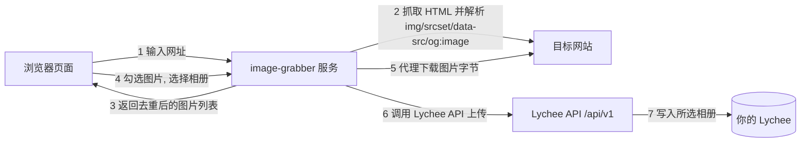

# 网页图片抓取 → Lychee (image-grabber)

> ⚠️ 本目录是 **Lychee v4.13.0 专用版**（API 走 v1，端口 8101）。
> 另有一个面向 v7.7.3 的版本在 `../lychee-web-grabber`（端口 8100）。
> 除原版全部功能外，本版新增 **清空相册**：在目标相册下拉框旁点「清空相册」，
> 删除该相册内的全部照片（相册本身保留，有确认弹窗）。

输入一个网址 → 在一个页面里预览该网页上的所有图片和视频 → 勾选想要的媒体 → 一键转存到你 Lychee 的指定相册。

## 思路(架构)



核心设计:

1. **提取**：后端抓取页面 HTML，解析 ``、`srcset`/`data-src`(懒加载)、`<picture><source>`、`og:image`、CSS `background-image`，用 `urljoin` 拼成绝对地址，自动取 srcset 中最高清版本并去重。
2. **预览**：浏览器不直接访问目标站(会被防盗链/CORS/混合内容拦截)，而是通过本服务的 `/api/proxy` 转发图片字节，并带上目标站的 `Referer` 绕过常见防盗链。
3. **转存**：两种方式二选一：
   - `multipart`(默认)：本服务下载图片字节 → `POST /api/v1/Photo` 上传到 Lychee。不依赖 Lychee 到外网的连通性，最稳。
   - `import`：调用 Lychee 的 `/api/v1/Import`，由 Lychee 服务端直接拉取图片 URL，适合图片本身就在公网、且希望节省本服务流量的场景。

**视频支持**：工具同样提取页面中的 `<video>`/`<source>`、`og:video` 以及指向 `.mp4/.webm/.mov` 等的下载链接，通过 `/api/proxy_stream` 流式代理预览（支持 Range 拖动进度条），选择后以 `multipart` 上传到 Lychee。单条视频默认上限 500MB（`MAX_VIDEO_BYTES`）。上传时会自动处理两种情况：
- CDN 把视频标成 `application/octet-stream` 或 URL 无扩展名 → 自动补 Lychee 支持的扩展名（如 `.mp4`），不再被 Lychee 拒收
- Lychee 不支持的格式（如 `.mkv`）→ 自动用 ffmpeg 转码为 mp4 后再上传

> 📖 **VPS 部署请看完整指南：[DEPLOY.md](DEPLOY.md)**（克隆、拉镜像、Nginx 反代、排错）

## 快速开始(Docker)

```bash
cd lychee-v4-web-grabber
cp .env.example .env      # 改成你的 Lychee 地址 / Token
docker compose up -d      # 默认拉取 GHCR 双架构镜像
```

浏览器打开 `http://<服务器IP>:8101`(compose 默认映射 8101 端口)。
首次拉取镜像约 1~3 分钟（含 Playwright Chromium）；想从源码构建时取消 compose 里 `build` 注释再用 `--build`。

## VPS 安装步骤（一步步来）

> 抓图服务默认**拉取 GHCR 预构建镜像**（`ghcr.io/dgltsp-cpu/lychee-v4-web-grabber:latest`，已含 linux/amd64 + linux/arm64 双架构，x86 VPS 可直接拉取运行）；想改代码可切换为源码构建。
> 前置：VPS 上已部署 Lychee v4（目录名 `lychee-v4`，见 https://github.com/dgltsp-cpu/lychee-v4），并在 Lychee 后台生成 API Token。

**步骤 1：克隆仓库**
```bash
git clone https://github.com/dgltsp-cpu/lychee-v4-web-grabber.git
```

**步骤 2：进入目录**
```bash
cd lychee-v4-web-grabber
```

**步骤 3：生成配置文件**
```bash
cp .env.example .env
```

**步骤 4：编辑配置（必改两项）**
```bash
nano .env
```
- `LYCHEE_URL=http://lychee-v4:80` —— 与 Lychee 同 Docker 网络，用容器服务名直连
- `LYCHEE_TOKEN=` —— 填 Lychee 后台生成的 API Token

**步骤 5：拉取镜像并启动（首次约 1~3 分钟）**
```bash
docker compose pull && docker compose up -d
```

**步骤 6：验证**
```bash
docker compose ps
curl -s http://127.0.0.1:8101 | head   # 返回页面 HTML 即成功
```

浏览器打开 `http://VPS_IP:8101` 即可使用。

### 获取 Lychee API Token

1. 登录你的 Lychee 后台
2. 进入 **设置 → API**
3. 点击 **新建令牌**(选择允许 API 访问相册的账户)
4. 把令牌复制到网页右上角设置里(或写入 `.env` 的 `LYCHEE_TOKEN`)

## 配置项(环境变量)

| 变量 | 默认值 | 说明 |
|---|---|---|
| `LYCHEE_URL` | 空 | Lychee v4 地址，同网络时 `http://lychee-v4:80` |
| `LYCHEE_TOKEN` | 空 | API Token，也可在网页端填写并存到浏览器 |
| `UPLOAD_METHOD` | `multipart` | `multipart` 或 `import`，见上文 |
| `MAX_IMAGES` | `200` | 单页最多收录的图片数 |
| `MAX_VIDEO_BYTES` | `524288000` | 单条视频大小上限(字节)，默认 500MB |
| `MAX_PAGE_BYTES` | 8MB | 页面 HTML 大小上限 |
| `MAX_IMAGE_BYTES` | 20MB | 单张图片大小上限 |
| `BLOCK_PRIVATE_NETWORKS` | `true` | 默认阻止内网/IPv6 本地地址，防 SSRF；抓内网站点改 `false` |
| `BATCH_CONCURRENCY_IMAGE` | `6` | 后台转存图片并发数。4核4G 可调到 6；页面卡或内存吃紧时调低到 2~4 |
| `BATCH_CONCURRENCY_VIDEO` | `1` | 后台转存视频并发数。视频文件大，建议保持 1 防内存爆 |
| `WEBP_CONVERT_DEFAULT` | `true` | 网页端「转存为 WebP」开关的默认值 |
| `WEBP_QUALITY` | `80` | 转 WebP 时的质量(0-100)，越低体积越小、画质越差 |
| `PORT` | `8000` | 容器内端口(compose 映射到 8101) |

## 后台转存（推荐）

实时「转存到 Lychee」由浏览器逐张发请求，手机断网/锁屏/关页面会中断。**后台转存**把整批链接一次性提交给服务器，由服务器后台线程**图片/视频分池并发**下载并上传（默认图片 6 并发、视频 1 并发，可用 `BATCH_CONCURRENCY_IMAGE/VIDEO` 调整；并发过高会把 CPU/内存打满，导致页面和进度变卡），手机断网也不影响：

- 勾选图片/视频 → 选相册 → 点 **后台转存**
- 选相册时自动递归列出 Lychee 嵌套子相册，下拉框里显示「父相册 / 子相册」层级路径（v4 的 `POST /api/Albums::get` 一次返回完整嵌套树）
- 页面每 1.5 秒轮询一次进度；断网时显示「等待重连」，网络恢复自动续传
- 任务 id 保存在浏览器 localStorage，刷新页面自动恢复进度
- 每张完成后显示 ✓ / ✗（✗ 可悬停查看失败原因）
- 任务在服务器内存中执行，完成后保留 1 小时自动清理；重启容器后未完成任务失效

接口：`POST /api/batch/create`（提交 `items` 列表 + 相册 + Lychee 配置）→ 返回 `task_id`；`POST /api/batch/status` 查询进度。单次最多 `500` 条，仅接受 http/https 直链。

> 注意：极少数「实际上已入库但页面标 ✗」的情况，重试会传第二份；建议先到 Lychee 相册核对再重试真正缺的。

## 转存为 WebP

转存时勾选「转存为 WebP」，图片会在服务器上转成 WebP 再上传（PNG/JPEG/BMP/AVIF 等源图均可转，透明通道与 EXIF 会保留；GIF、已是 WebP 的图自动跳过，视频不受影响）。Lychee 里原图、小图、中图都会是 WebP，体积通常比 JPEG 小 25~35%；缩略图仍是 Lychee 生成的 JPEG（Lychee 写死）。

- 勾选后上传成功显示「✓ 已转存·WebP」
- 开关状态保存在浏览器 localStorage，默认开启（可用 `WEBP_CONVERT_DEFAULT=false` 改为默认关闭）
- 转码会占用服务器 CPU，批量大图建议用「后台转存」，由服务器排队执行
- 仅 `UPLOAD_METHOD=multipart` 时生效；`import` 模式由 Lychee 直接拉取 URL，不经过本服务，无法转码

## 与 Lychee 同 Docker 网络(可选)

如果 Lychee 与本服务在同一个 docker 网络中，可省去对局域网 IP 的依赖，在容器内直接用服务名访问：

本仓库的 `docker-compose.yml` 已配好外部网络 `lychee-v4_default`（Lychee v4 部署目录为 `lychee-v4` 时 compose 自动生成的网络名），容器内直接用服务名访问 `LYCHEE_URL=http://lychee-v4:80`。若你的 Lychee 部署目录名不同，先 `docker network ls` 找到网络名并同步修改 compose 里的 `name` 与 `LYCHEE_URL`。

## VPS 通过 GitHub 部署

本仓库已托管（**公开**）：https://github.com/dgltsp-cpu/lychee-v4-web-grabber，VPS 上克隆后**直接拉取 GHCR 预构建镜像**运行（`ghcr.io/dgltsp-cpu/lychee-v4-web-grabber:latest`，compose 默认指向镜像，无需本地构建）；想改代码可取消 compose 里 `build` 注释自行构建。前置要求：**VPS 上已先部署 Lychee v4**（克隆 https://github.com/dgltsp-cpu/lychee-v4.git，目录名保持 `lychee-v4`，这样 compose 网络名才是 `lychee-v4_default`），并在 Lychee 后台 设置 → API 生成 Token。

### 1. 克隆（公开仓库，无需密钥）

```bash
git clone https://github.com/dgltsp-cpu/lychee-v4-web-grabber.git
cd lychee-v4-web-grabber
```

### 2. 配置 .env

```bash
cp .env.example .env
nano .env
```

必填项：

- `LYCHEE_URL=http://lychee-v4:80` — 与 Lychee v4 同 Docker 网络（`lychee-v4_default`），用容器服务名直连，不要填公网 IP
- `LYCHEE_TOKEN=` 填 Lychee 后台生成的 API Token
- 按需调整 `UPLOAD_METHOD`、`MAX_IMAGES`、`BLOCK_PRIVATE_NETWORKS` 等

### 3. 拉取镜像并启动

```bash
docker compose pull && docker compose up -d
```

首次拉取镜像约 1~3 分钟（含 Playwright Chromium）。验证：

```bash
docker compose ps
curl -s http://127.0.0.1:8101 | head   # 返回页面 HTML 即成功
```

浏览器打开 `http://VPS_IP:8101` 即可使用（如需要更安全，把 compose 端口改成 `127.0.0.1:8101:8000` 并加 Nginx 反代）。

### 4. 升级（推荐：直接拉新镜像）

镜像已包含 linux/amd64 与 linux/arm64 双架构，升级只需重新拉取并重建容器，**无需在 VPS 上重新构建**（省去下载 Playwright Chromium 的时间）：

```bash
git pull
docker compose pull && docker compose up -d
```

> 若改动涉及 `docker-compose.yml` 里的环境变量或命令，重建容器后生效：`docker compose up -d --force-recreate`。旧版双 worker 导致后台转存进度丢失的问题，升级到新镜像即修复（单 worker + 图片并发默认 6）。

如果想基于最新源码重新构建（改动 Dockerfile/依赖时用）：

```bash
docker compose up -d --build
```

### 常见问题

- `network lychee-v4_default declared as external, but could not be found`：Lychee v4 还没启动，或 Lychee 项目目录名不是 `lychee-v4`。先启动 Lychee 再启动本服务。
- 上传失败：确认 `LYCHEE_URL=http://lychee-v4:80` 且 `LYCHEE_TOKEN` 正确；可在网页端右上角设置里填入 Token 覆盖。
- 抓内网站点 502：`.env` 里 `BLOCK_PRIVATE_NETWORKS=false` 后重建容器。

## 本地开发与测试

```bash
python3 -m venv .venv && source .venv/bin/activate
pip install -r requirements.txt
python app.py          # http://localhost:8000
pytest tests/ -v       # 全部用本地 HTTP 服务器测试，不需要公网
```

## 常见问题

- **Lychee 返回 401**：Token 无效或账户权限不足，到 设置 → API 重新生成。
- **图片预览显示“加载失败”**：目标站点防盗链严格，可手动点击图片尝试；或换 `UPLOAD_METHOD=import` 让 Lychee 自己拉取。
- **提取不到图片**：页面可能是 JS 动态渲染(SPA)或需要登录，静态 HTML 里没有图片。可先用浏览器打开页面再让工具抓取已经渲染后的地址；本工具已覆盖常见的 `data-src`/`data-original` 懒加载写法。
- **抓内网站点 502**：`BLOCK_PRIVATE_NETWORKS` 默认 `true`，抓内网需显式设为 `false`。

## 安全提醒

这是一个自托管工具，适合放在局域网或带鉴权的环境使用；未做多用户权限控制，请勿直接暴露到公网。Lychee Token 建议只给最小权限的账户。
